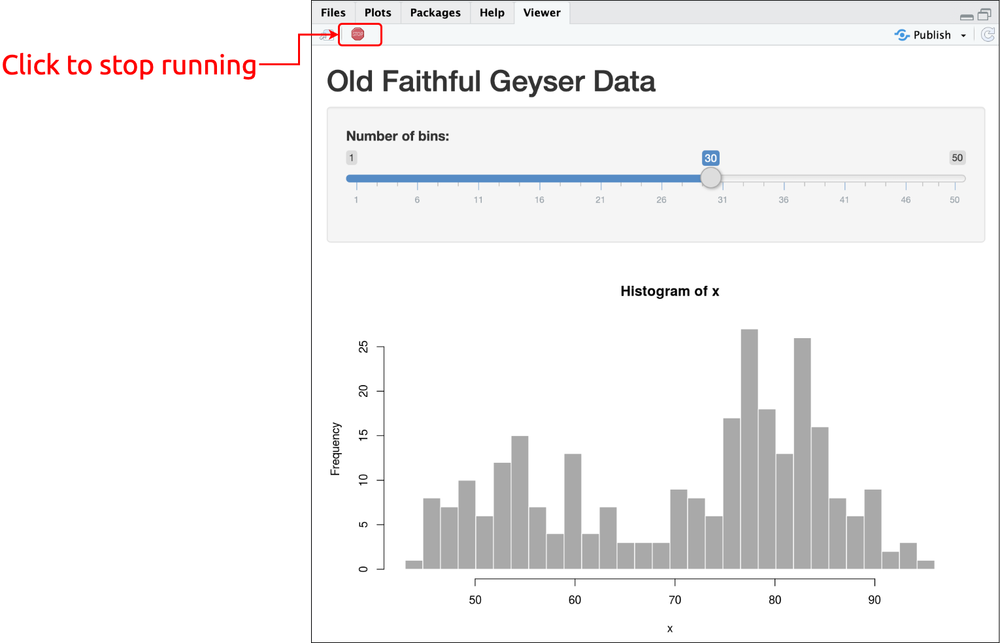

```{r setup, include=FALSE}
library(tidyverse)
library(reprex)
library(xaringan)
library(pagedown)
library(xaringanthemer)
# folders
folders <- c("code", "data", "img", "pdfs")
purrr::map(.x = folders, .f = fs::dir_create)
knitr::opts_chunk$set(warning = FALSE,
                      message = FALSE,
                      eval = TRUE,
                      fig.align = "center",
                      dpi = 320,
                      fig.height = 4,
                      fig.path = "img/")
options(width = 60,
        max.print = 60)
# download.file(url = "https://raw.githubusercontent.com/rstudio/hex-stickers/master/PNG/shiny.png", 
              # destfile = "img/shiny.png")
```

```{r xaringan-themer-and-xaringan-inf_mr(), include=FALSE, warning=FALSE}
xaringanthemer::style_duo_accent(primary_color = "#035AA6", 
                                 secondary_color = "#03A696")
# xaringan::inf_mr() # use for instant knitting and reviewing
```

class: inverse, center, top
background-image: url(img/shiny.png)
background-position: 50% 70%
background-size: 35%

# `Shiny` = Web Applications with R

---
class: left, top
background-image: url(img/shiny.png)
background-position: 95% 8%
background-size: 8%

# Load the packages

<br><br><br>

```{r packages, eval=FALSE}
install.packages(c("tidyverse", "inspectdf",
                   "shiny", "flexdashboard",
                   "reactable", "gtrendsR"))
library(tidyverse)
library(shiny)
library(inspectdf)
library(flexdashboard)
library(reactable)
library(gtrendsR)
```

---
class: left, top
background-image: url(img/shiny.png)
background-position: 95% 8%
background-size: 8%

# Materials

## Slides

https://mjfrigaard.github.io/intro-to-shiny/Index.html

## Exercises

*coming soon!*

## RStudio Project

https://rstudio.cloud/project/2021718


---
class: left, top
background-image: url(img/shiny.png)
background-position: 95% 8%
background-size: 12%

## Outline

.pull-left[

### Shiny app anatomy

- ui  
- server  
- run

### User Interface (UI)

- build layout (`fluidPage()`)

- define `input`s

]

.pull-right[

### Server

- build `reactive()`

- use `input`s with `output`

### `flexdashboard`

- Uses R Markdown

- Convert from static to shiny app

]


---
class: left, top
background-image: url(img/shiny.png)
background-position: 95% 8%
background-size: 12%

# Create a new app

```{r new-app, echo=FALSE, out.width="80%", out.height="80%"}
knitr::include_graphics("img/new-app.png")
```

---
class: left, top
background-image: url(img/shiny.png)
background-position: 95% 8%
background-size: 12%

# Run app

<br><br><br>

.pull-left[

```{r view-in-viewer, echo=FALSE, out.width="100%", out.height="100%"}
knitr::include_graphics("img/view-in-viewer.png")
```

]

.pull-right[

```{r run-app, echo=FALSE, out.width="100%", out.height="100%"}

```

]

---
class: left, top
background-image: url(img/shiny.png)
background-position: 95% 8%
background-size: 12%

# Stop running app

<br><br>

```{r click-to-stop, echo=FALSE, out.width="80%", out.height="80%"}

```

---
class: inverse, center, top
background-image: url(img/shiny.png)
background-position: 50% 70%
background-size: 35%

# Anatomy of a shiny app

---
class: left, top
background-image: url(img/shiny.png)
background-position: 95% 8%
background-size: 12%

## Shiny app internals

### User interface (UI)

```{r add-ui, eval=FALSE}
ui <- fluidPage()
```

--

### Server

```{r add-server, eval=FALSE}
ui <- fluidPage()
server <- function(input, output) {}
```

--

### Run

```{r add-shinyApp, eval=FALSE}
ui <- fluidPage()
server <- function(input, output) {}
shinyApp(ui = ui, server = server)
```

---
class: left, top
background-image: url(img/shiny.png)
background-position: 95% 8%
background-size: 12%

# Example shiny app

<br>

### Open the app.R in `google-trends/`

```{r app-tree, eval=FALSE}
google-trends/
            └── app
                ├── app.R # application
                └── data
                    └── 2020-12-13-BmrnGoogleIOT.csv # data
```


---
class: left, top
background-image: url(img/shiny.png)
background-position: 8% 95%
background-size: 9%

# `google-trends/` data input

### Locate the .csv file in `google-trends/app/data`

<br>

```{r import-data-1, echo=FALSE, out.width="80%", out.height="80%"}

```

---
class: left, top
background-image: url(img/shiny.png)
background-position: 8% 95%
background-size: 8%

# `google-trends/` data input

### Import the .csv file in 

```{r import-data-2, echo=FALSE, out.width="80%", out.height="80%"}

```

---
class: left, top
background-image: url(img/shiny.png)
background-position: 8% 95%
background-size: 8%

# `google-trends/` data input

### View the imported .csv file 

```{r import-data-3, echo=FALSE, out.width="80%", out.height="80%"}

```

---
class: inverse, center, top
background-image: url(img/shiny.png)
background-position: 50% 70%
background-size: 35%

# The User Interface (ui)

---
class: left, top
background-image: url(img/shiny.png)
background-position: 95% 8%
background-size: 12%

# UI: `fluidPage()`


```{r sidebar, echo=FALSE, out.width="60%", out.height="60%"}

```
.pull-right[Image by Hadley Wickham]


---
class: left, top
background-image: url(img/shiny.png)
background-position: 8% 95%
background-size: 8%

# fluidPage: `sidebarLayout()`

This consists of a `sidebarPanel()` and `mainPanel()`

```{r sidebarLayout, eval=FALSE}
ui <- fluidPage(
            titlePanel(title = "BioMarin Google Trends"),
                sidebarLayout( #<<
                    sidebarPanel(
                    
                    ),
                    mainPanel(
                    
                    )
                  )
                )
```


---
class: left, top
background-image: url(img/shiny.png)
background-position: 95% 8%
background-size: 9%

# fluidPage: `sidebarPanel()`

The `selectInput()` and `dateRangeInput()` are in the `sidebarLayout()`

```{r sidebarPanel, eval=FALSE}
sidebarLayout(
    sidebarPanel(#<<
      # Select trend term to plot
      selectInput(inputId = "key",
                  label = strong("Trend Term"),
                  choices = unique(BmrnGoogleIOT$keyword),
                  selected = "BioMarin"),

      # Select date range to be plotted
      dateRangeInput(inputId = "date", strong("Date range"),
                     start = "2019-12-15", end = "2020-12-06",
                     min = "2019-12-15", max = "2020-12-06"),
    ), # note the comma! #<<
```

---
class: left, top
background-image: url(img/shiny.png)
background-position: 8% 95%
background-size: 8%

# fluidPage: `sidebarPanel()`

This consists of a `sidebarPanel()` and `mainPanel()`

<br>

```{r sidebarPanel-out, echo=FALSE, out.width="80%", out.height="80%"}

```

---
class: left, top
background-image: url(img/shiny.png)
background-position: 95% 8%
background-size: 9%

# fluidPage: `mainPanel()`

The `plotOutput()` and text (`tags`) output will going into the `mainPanel()`

```{r mainPanel, eval=FALSE}
    sidebarLayout(
), # note the comma! #<<
      mainPanel(
        plotOutput(outputId = "lineplot",
                   height = "300px"),
        tags$a(href = "https://www.google.com/",
               "Source: Google Trends",
               target = "_blank"))
      )
    )#<<
```


---
class: left, top
background-image: url(img/shiny.png)
background-position: 95% 8%
background-size: 9%

# fluidPage: `mainPanel()`

The `plotOutput()` and text (`tags`) output will going into the `mainPanel()`

<br><br>

```{r mainPanel-out, echo=FALSE, out.width="80%", out.height="80%"}

```

---
class: left, top
background-image: url(img/shiny.png)
background-position: 95% 8%
background-size: 9%

# UI layout

<br>

```{r ui-layout, echo=FALSE, out.width="100%", out.height="100%"}

```

---
class: inverse, center, top
background-image: url(img/shiny.png)
background-position: 50% 70%
background-size: 35%

# The Server

---
class: left, top
background-image: url(img/shiny.png)
background-position: 8% 95%
background-size: 8%

## `server`

### The `server` is comprised of the `input` & `output`

<br>

```{r server-components, eval=FALSE}
function(input, output) {
  # data input
  # plot output
}
```

### Elements from the `ui` (`inputId`, `outputId`) get passed to the `server`

---
class: left, top
background-image: url(img/shiny.png)
background-position: 95% 8%
background-size: 7%

# Build `reactive` dataset (1)

Require `date` variable `input` from from `dateRangeInput()`:

```{r reactive-1, eval=FALSE}
selected_trends <- reactive({
    req(input$date) #<<
```

--

Print errors if `date`s from `dateRangeInput()` are selected incorrectly

```{r reactive-2, eval=FALSE}
selected_trends <- reactive({
    req(input$date)
    validate(need(!is.na(input$date[1]) & !is.na(input$date[2]),
        "Error: Please provide both a start and an end date."))#<<
    validate(need(input$date[1] < input$date[2],
         "Error: Start date should be earlier than end date."))#<<
```


---
class: left, top
background-image: url(img/shiny.png)
background-position: 95% 8%
background-size: 7%

# Build `reactive` dataset (2)

Filter these data by the `key` from the `selectInput()` and the `date` from `dateRangeInput()`

```{r reactive-components, eval=FALSE}
function(input, output) {
  selected_trends <- reactive({
    #....
    #....
    BmrnGoogleIOT %>% #<<
      filter(keyword == input$key, #<<
        date > as.POSIXct(input$date[1]) & #<<
          date < as.POSIXct(input$date[2])) #<<
  })
}
```


---
class: left, top
background-image: url(img/shiny.png)
background-position: 8% 95%
background-size: 7%

## Build `reactive` dataset (3)

### 1) Use `reactive({})` to build data

```{r selected_trends-react, eval=FALSE}
  selected_trends <- reactive({
      # inputs from ui are passed are used to filer .csv file
  })
```

--

### 2) Call `selected_trends()` in `server`

Now whenever we need to use the dataset, we can refer to it using **`selected_trends()`**

```{r use-reactive, eval=FALSE}
selected_trends() %>% 
  ggplot(aes(x = date, y = hits))
```

---
class: left, top
background-image: url(img/shiny.png)
background-position: 8% 95%
background-size: 7%

## Build plot with `renderPlot({})` (1)

<br>

- Use `output$lineplot`...

  - which matches `plotOutput(outputId = "lineplot")`
  
--

<br>

```{r renderPlot-1, eval=FALSE}
  output$lineplot <- renderPlot({ #<<
```

--

<br>

Each `outputId` in the `ui` can be used in the `server` with `output`.

---
class: left, top
background-image: url(img/shiny.png)
background-position: 8% 95%
background-size: 7%

## Build plot with `renderPlot({})` (2)

<br>

Use **`selected_trends()`** (the reactive dataset) to build the `ggplot2` object:

```{r use-reactive-ggplot2, eval=FALSE}
    selected_trends() %>% #<<
      ggplot(aes(x = date, y = hits, 
                 color = Location, group = keyword)) +
      geom_line(aes(group = Location),
                show.legend = FALSE) +
      facet_wrap(. ~ Location, nrow = 2) +
      theme_minimal() +
      labs(x = "Date", y = "Hits")
  })
```

---
class: left, top
background-image: url(img/shiny.png)
background-position: 95% 8%
background-size: 9%

# Server layout

<br>

```{r server-layout, echo=FALSE, out.width="100%", out.height="100%"}

```

---
class: left, top
background-image: url(img/shiny.png)
background-position: 95% 8%
background-size: 7%

## Run the app!

```{r shinyApp-run, eval=FALSE}
shinyApp(ui = ui, server = server)
```

```{r full-shiny, echo=FALSE, out.width="100%", out.height="100%"}

```


---
class: inverse, center, top
background-image: url(img/shiny.png)
background-position: 50% 70%
background-size: 35%

# `flexdashboard` and `shiny`

---
class: left, top
background-image: url(img/shiny.png)
background-position: 95% 8%
background-size: 7%

## Create new `flexdashboard` file

### File > New File > R Markdown

```{r new-rmd, echo=FALSE, out.width="100%", out.height="100%"}

```

---
class: left, top
background-image: url(img/shiny.png)
background-position: 95% 8%
background-size: 10%

## Add `runtime: shiny` to `YAML`

<br>

```{r runtime-shiny, echo=FALSE, out.width="100%", out.height="100%"}

```

---
class: left, top
background-image: url(img/shiny.png)
background-position: 95% 8%
background-size: 10%

## Add `setup` chunk

<br><br>

```{r setup-chunk, echo=FALSE, out.width="100%", out.height="100%"}

```

---
class: left, top
background-image: url(img/shiny.png)
background-position: 95% 8%
background-size: 10%

## Define `input`s

<br><br>

```{r define-inputs, echo=FALSE, out.width="100%", out.height="100%"}

```

---
class: left, top
background-image: url(img/shiny.png)
background-position: 95% 8%
background-size: 10%

## Define `reactive`

<br><br>

```{r define-reactive, echo=FALSE, out.width="100%", out.height="100%"}

```

---
class: left, top
background-image: url(img/shiny.png)
background-position: 95% 8%
background-size: 10%

## Build plot with `renderPlot()`

<br>

```{r flex-renderPlot, echo=FALSE, out.width="100%", out.height="100%"}

```

---
class: left, top
background-image: url(img/shiny.png)
background-position: 95% 8%
background-size: 10%

## Save and `Run Document`

<br><br><br><br>

```{r save-and-run, echo=FALSE, out.width="100%", out.height="100%"}

```

---
class: left, top
background-image: url(img/shiny.png)
background-position: 95% 8%
background-size: 10%

## Our app as a `flexdashboard`!!

<br><br>

```{r full-dash, echo=FALSE, out.width="100%", out.height="100%"}

```

---
class: left, top
background-image: url(img/shiny.png)
background-position: 95% 8%
background-size: 12%

# More Resources:

<br><br>

### [Shiny](https://shiny.rstudio.com/): RStudio resources

### [Mastering Shiny](https://mastering-shiny.org): A text from Hadley Wickham

### [Engineering Production-Grade Shiny Apps](https://engineering-shiny.org/): A text from ThinkR

```{r chrome_print, eval=FALSE, include=FALSE, echo=FALSE}
fs::dir_create("pdfs")
pagedown::chrome_print(input = "Index.html", timeout = 90,
                       output = "pdfs/intro-to-shiny-slides.pdf")
```
